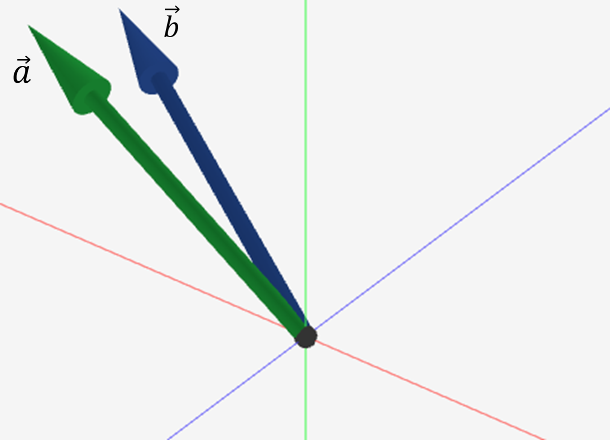
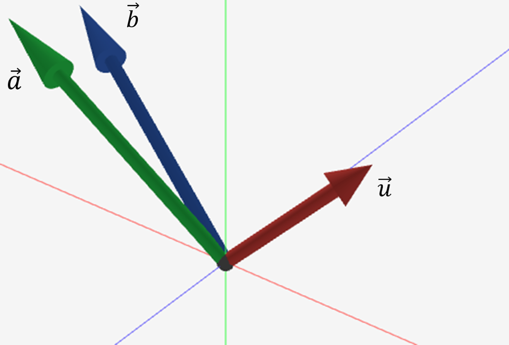
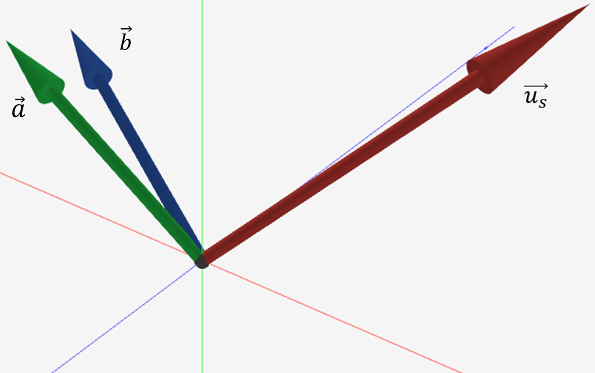
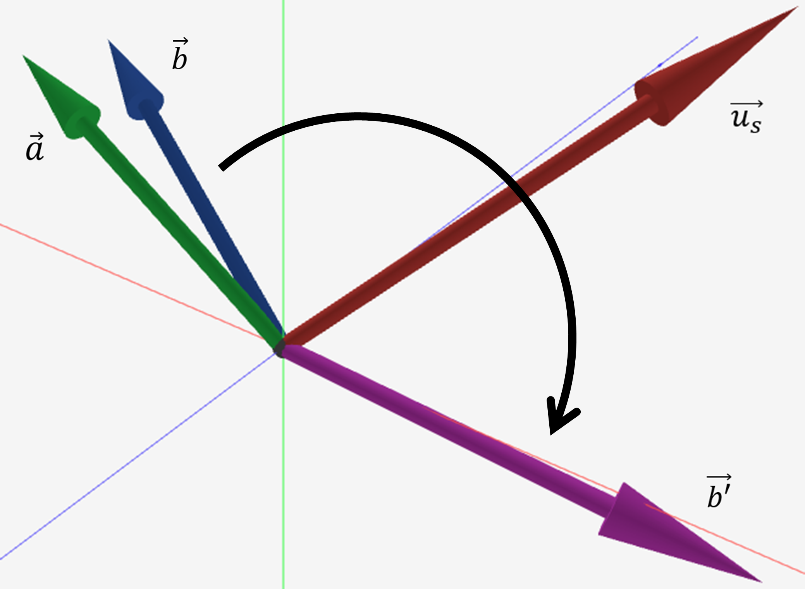
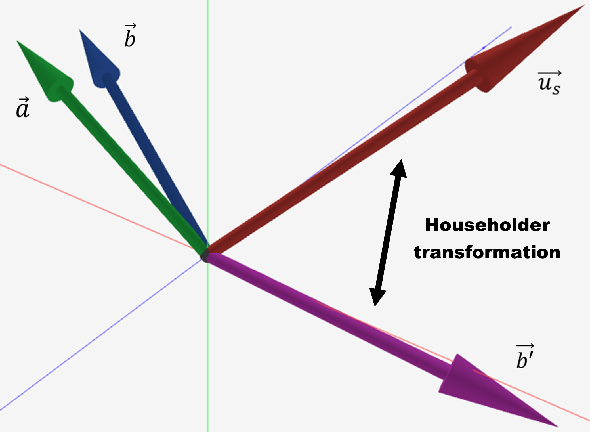

## Multi-dimensional Vector Rotation via Householder Transformation

We consider a $d$-dimensional space, illustrated here in 3D to aid understanding, focusing on a single sub-vector of the reconciliation frame. The aim is to provide a visual understanding of the Householder transformation, i.e. the mechanism that enables a virtual channel in arbitrarily high dimensions. For clarity and pedagogical purposes, we present the standard construction, which has computational complexity $O(d^3)$.

### 1. Transmission
Alice sends a vector $\vec{a}$, and Bob receives a noisy version $\vec{b}$.

{ width="400", .centered }

### 2. Key Representation
Bob generates a vector $\vec{u}$, which encodes the target key.

{ width="400", .centered }

### 3. Norm Scaling
Bob rescales $\vec{u}$ so that $\|\vec{u}\| = \|\vec{b}\|$.  
This ensures the transformation between them can be purely orthogonal.

{ width="400", .centered }

### 4. Randomisation
Bob applies a random rotation to $\vec{b}$, producing $\vec{b}'$.  
This step hides structural information and introduces randomness.

{ width="400", .centered }

### 5. Householder Construction
Bob computes a Householder transformation that maps $\vec{b}'$ to $\vec{u_s}$.

{ width="400", .centered }

A Householder matrix is defined as:

\[
H = I - 2 \frac{\vec{v}\vec{v}^T}{\vec{v}^T \vec{v}},
\]

where:

\[
\vec{v} = \vec{b}' - \vec{u_s}.
\]

This transformation reflects $\vec{b}'$ onto $\vec{u}$.

### 6. Final Rotation Matrix
By composing the random rotation and the Householder reflection, Bob obtains a single orthogonal matrix that maps the original $\vec{b}$ to $\vec{u_s}$.
